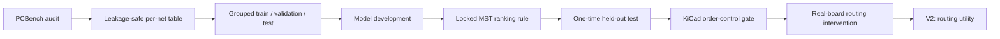

# RouteScout

Release: **v1.0.0** · License: **MIT**

## Predicting high-cost PCB nets before routing starts

**RouteScout is a pre-routing decision-support research project for PCB routing.**

I built it around a practical engineering question:

> **Before the router touches the board, can pre-routing geometry tell me which nets are likely to consume the most routed length?**

For RouteScout v1, the answer is **yes — strongly enough to be useful as a ranking signal on held-out boards**.

The harder follow-up question is different:

> **Once I know which nets are likely to be expensive, what routing action should I take to improve the final outcome?**

V1 tested the simplest intervention — routing predicted-expensive nets first — but did **not** establish that this policy reliably improves routability. That makes routing-action utility the main open problem for V2.


---

## At a glance

| Item | Result |
|---|---:|
| PCB designs | **1,182** |
| Nets observed on Phase-2 eligible boards | **47,101** |
| Supervised net candidates | **47,051** |
| Held-out ranking-eligible boards | **154** |
| Final ranking method | **Terminal MST** |
| Mean board-wise Spearman | **0.9240** |
| Top-5 cost capture | **0.9810** |
| Top-5 overlap | **0.8429** |
| NDCG@5 | **0.9807** |
| MST log-MAE | **0.1417** |
| CatBoost residual log-MAE | **0.1247** |
| Real-router intervention | **24 boards / 72 policy runs** |

**Dataset note:** 47,101 nets were observed on Phase-2 eligible boards. I excluded 45 degenerate-terminal cases and 5 nets with no positive routed length, leaving 47,051 supervised candidates.

---

## What RouteScout predicts

RouteScout predicts **observed routed cost**.

In this project, that means the routed track length a net actually consumed in an existing completed routing solution.

That target is useful because it lets me ask whether geometry available **before routing** contains information about future routing cost.

It is important not to overstate the target:

- it is **not** intrinsic or universal “true difficulty”;
- it is **not** signal integrity;
- it is **not** impedance;
- it is **not** RF importance;
- it is **not** EMI risk;
- it is **not** electrical criticality.

A net can be geometrically expensive while electrically ordinary, or electrically critical while geometrically simple.

---

## The core idea: terminal MST

The strongest ranking signal turned out to be surprisingly simple: **terminal MST length**.

For each net, I take its terminal positions and build a short geometric tree connecting those terminals. This gives a compact measure of how spatially spread out that connection problem is.

The terminal MST is:

- computed before routing;
- simple and fast;
- based on terminal geometry;
- useful as a ranking feature;
- **not** a legal PCB route;
- **not** an autorouter;
- **not** a universal physical lower bound.

That simple geometric signal was already strong enough that more model complexity did not justify replacing it for the ranking task.

---

## Evidence flow



I deliberately separated **prediction** from **intervention**.

A predictor can correctly identify expensive nets without automatically telling a router what action will improve the final routing.

That distinction became one of the most important findings of the project.

---

# Part I — Prediction

## Held-out result

After choosing the final ranking rule, I evaluated it once on the held-out test set.

| Metric | MST-only |
|---|---:|
| Mean board-wise Spearman | **0.9240** |
| Top-5 cost capture | **0.9810** |
| Top-5 overlap | **0.8429** |
| NDCG@5 | **0.9807** |
| log-MAE | **0.1417** |


### How to read those numbers

**Mean board-wise Spearman = 0.924**

Within an unseen board, the nets RouteScout ranked as expensive were usually very close to the nets that actually ended up expensive in the completed routed solution.

**Top-5 cost capture = 0.981**

When RouteScout selected the five nets expected to be most costly, those five captured almost all of the routed-cost concentration represented by the board's actual top-five costly nets.

This is **not “98.1% accuracy.”** It is a cost-capture metric.

---

## Did a learned model help?

Yes — but for a different task.

I tested a CatBoost residual model. It improved the accuracy of **cost magnitude estimation**:

- MST log-MAE: **0.1417**
- CatBoost residual log-MAE: **0.1247**

That is useful if the question is:

> “How much routed cost might this net have?”

But the simpler MST rule remained the final method for the main ranking question:

> “Which nets should I pay attention to first?”

So I kept MST as the frozen ranking method instead of adding model complexity only because it was available.

---

## Why I did not add a GNN

PCBs naturally contain graph structure, so a graph neural network was an obvious candidate.

But “the data is a graph” is not enough reason to add a GNN.

I used an admission gate: the extra relational structure had to show evidence that it could address a real weakness in the simpler methods.

That evidence was not strong enough.

So I deliberately stopped before adding a GNN.

This is an engineering choice, not a missing feature: **complexity had to earn its place.**

---

# Part II — Intervention

## The harder question

Once RouteScout could identify expensive nets, I tested the obvious next idea:

> **If a net is predicted to be expensive, should the router route it first?**

This is a different problem from prediction.

A strong ranking tells me **what is likely to happen**.

A useful routing policy must tell me **what action will improve the final outcome**.

Those are not the same thing.

---

## Real KiCad routing experiment

I tested routing order in a real KiCad/PCBWorld-based environment.

The experiment used:

- **24 valid real-board cases**
- **3 routing policies per board**
- **72 policy runs**
- **0 API errors**
- the requested locked net order was issued correctly in all **72** runs

The policies compared the router's natural order with MST-based hard-first and easy-first ordering.


For **MST-hard-first minus natural order**, the mean target-routability delta was:

**+0.01290**

with a 95% paired-bootstrap interval of:

**[0.00000, 0.03177]**


The point estimate moved in the positive direction, but the preregistered rule required the lower confidence bound to be **strictly greater than zero**. That threshold was not met.

### What I conclude from this

I do **not** conclude that routing order has no value.

I do **not** conclude that hard-first is harmful.

I do **not** conclude that the predictive model failed.

The correct v1 interpretation is:

> **RouteScout established a strong pre-routing cost-ranking signal. The utility of using that signal as a hard-first routing policy remains unresolved.**

For reproducibility, the frozen Phase 8B protocol records the formal decision label:

`NO_CLEAR_ROUTABILITY_BENEFIT`

That label means the preregistered evidence threshold was not crossed. It does **not** mean that the experiment proved zero benefit.

---

# What v1 established

RouteScout v1 gives me three useful engineering conclusions.

### 1. Pre-routing geometry carries substantial information

Terminal geometry alone was highly informative for ranking eventual routed cost on held-out boards.

### 2. More AI was not automatically better

CatBoost helped estimate cost magnitude, but the simple MST signal remained sufficient for the main ranking task. A GNN was not justified by the evidence available in v1.

### 3. Prediction is not routing policy

Knowing which nets will probably become expensive is easier than knowing which early routing decision will improve the completed board.

That gap is the main research opportunity opened by v1.

---

## What RouteScout is — and is not

### RouteScout v1 is

- a pre-routing PCB net-cost ranking experiment;
- a leakage-controlled held-out evaluation;
- a comparison of simple geometry and learned residual prediction;
- a real-router routing-order intervention;
- an evidence-driven prototype for early routing decision support.

### RouteScout v1 is not

- an autorouter;
- a replacement for a PCB layout engineer;
- an SI/RF/impedance engine;
- a claim that routed length is universal ground-truth difficulty;
- a claim that geometrically expensive nets are electrically important;
- proof that hard-first routing is the optimal policy;
- a claim that a GNN is superior;
- a new routing algorithm presented as production-ready.

---

## Where this could become useful

The most credible product direction is an **early design-assistance layer**.

A future EDA workflow could use RouteScout-style geometry to surface nets that are likely to consume disproportionate routing cost before detailed routing begins.

For example:

```text
Net        Geometric routing attention
---------  ---------------------------
N$27       High
DDR_DQ4    High
GPIO14     Low
LED3       Low
```

That ranking should sit **alongside**, not replace, engineering constraints such as:

- controlled impedance;
- differential-pair rules;
- timing;
- RF layout;
- high-current routing;
- isolation and creepage;
- EMI constraints.

---

# V2 — from cost prediction to routing utility

V1 asked:

> **Which nets are likely to become expensive?**

V2 should ask:

> **Which early routing action has positive marginal utility for the final routing outcome?**

That means moving beyond a fixed “hard-first” heuristic and studying decisions such as:

- when a net should receive early routing attention;
- which local congestion or topology context changes the value of routing it early;
- when preserving routing freedom for later nets matters more than solving the expensive net first;
- which action-level signals predict a better final routing outcome.

The goal is no longer just to predict cost.

The goal is to learn **which decision actually helps**.

---

# Repository map

```text
src/routescout/   reusable analysis, integrity and router helpers
tests/            unit and frozen-result regression checks
notebooks/        four readable public notebooks
configs/          frozen Phase 8 protocol / manifest inputs
results/          compact frozen metrics and replay tables
figures/          selected evidence figures
reports/          notes for generated offline evidence (not stored in Git history)
docs/             methodology, limitations, reproducibility and scientific history
scripts/          bootstrap and verification utilities
environment/      dependency specifications (Phase 8 toolchain is pinned)
```

---

## Notebooks

1. `01_model_and_evaluation.ipynb`  
   Data audit, feature work, model comparison, validation, and one-time held-out evaluation.

2. `02_router_mechanism.ipynb`  
   Frozen Phase 8A mechanism evidence plus the optional full Linux rerun path.

3. `03_real_board_intervention.ipynb`  
   Frozen Phase 8B replay plus the optional full real-router rerun.

4. `04_final_results.ipynb`  
   Compact final release story and primary results.

The Phase 7 notebook section also contains presentation-only held-out plots generated from the already-frozen Phase 7 results.

---

## Executed evidence and provenance

I kept the public notebooks readable and reproducible rather than turning the repository into a dump of generated artifacts.

Compact frozen result tables live under `results/`.

The notebooks replay released analyses from those tables.

Large generated offline HTML reports are intentionally not stored in Git history. `reports/README.md` documents their role and the canonical release hashes.

Public figure provenance is mapped in:

`docs/figure_provenance.md`

Tracked SVG figures can be regenerated from frozen tables.

---

# Reproducing the lightweight checks

RouteScout requires **Python 3.11+** for the public development environment.

CI currently tests:

- Python **3.11**
- Python **3.12**

On some macOS installations, `/usr/bin/python3` may still be Python 3.9, so do not rely on that interpreter for this repository.

### Recommended setup

```bash
bash scripts/setup_dev_env.sh
```

### Manual setup

```bash
python3.12 -m venv .venv
source .venv/bin/activate

python -m pip install --upgrade pip
pip install -e ".[dev]"

python -m ruff check src scripts tests
python scripts/static_check.py
pytest -q
python scripts/verify_frozen_results.py
python -m pip check
```

For the full ML notebook:

```bash
pip install -e ".[ml,dev]"
```

Phase 8 uses a pinned PCBWorld/KiCad toolchain and is intentionally separate from the lightweight CI environment.

See:

`docs/reproducibility_frozen.md`

---

## Claim boundary

The strongest claim supported by RouteScout v1 is about **ranking observed routed cost before routing**.

The project does not claim that:

- routed length is intrinsic ground-truth routing difficulty;
- terminal MST is a legal route or universal lower bound;
- learned models are always unnecessary;
- GNNs cannot help PCB routing problems;
- routing expensive nets first is proven beneficial;
- the v1 prototype is a finished EDA product.

See `docs/limitations.md` for the detailed boundary.

---

## Development note

RouteScout v1.0 began as a Google Colab research prototype and evolved through exploratory experiments, failed ideas, model comparisons, validation gates, and real-router testing.

Before release, I refactored it into a conventional Python repository and re-validated it in a clean Python 3.11 environment using VS Code on macOS.

AI-assisted development tools were used during implementation, debugging, code review, refactoring, and documentation.

The released scientific decisions and numerical results were preserved through frozen artifacts, regression tests, checksums, and reproducibility checks.

---

## One-sentence summary

> **RouteScout can identify which nets are likely to become geometrically expensive before routing; v1 also showed that predicting the expensive nets is not the same problem as choosing the routing action that improves the final result.**

---

## License

MIT. See `LICENSE`.
