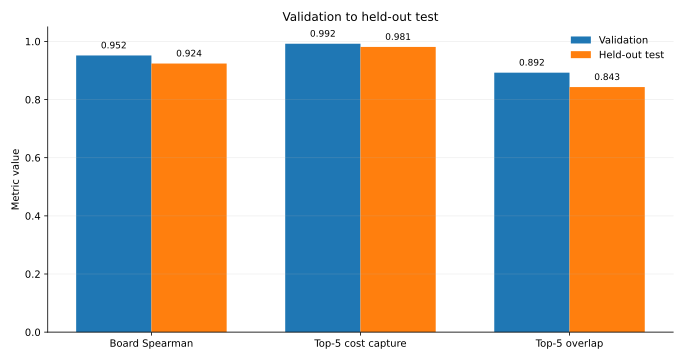
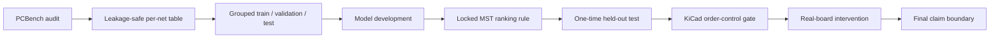
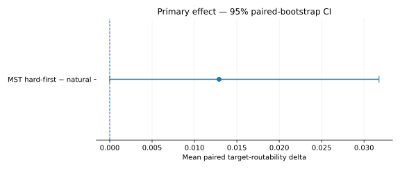
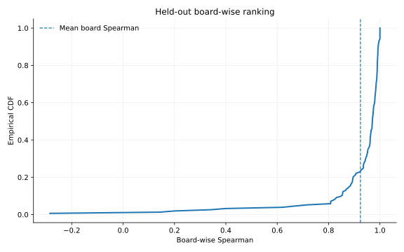
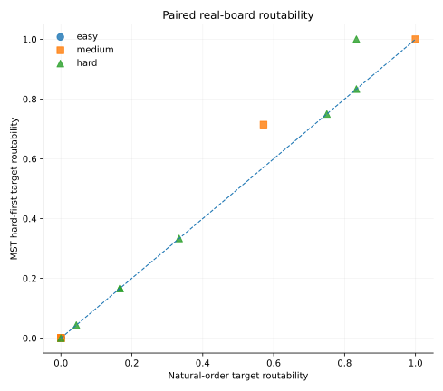

# RouteScout

Release: **v1.0.0** · License: **MIT**

**Predicting which PCB nets will be expensive to route — before routing them.**

RouteScout is a research/engineering project built around one practical question: can pre-routing geometry identify the nets that end up expensive in an existing routed solution? The project follows that question from dataset audit to a sealed held-out test, then checks whether changing net order actually helps a real router.

**1,182 PCB designs · 47,051 supervised nets · held-out mean board Spearman 0.924 (154 ranking-eligible boards) · Top-5 cost capture 0.981**




## Evidence flow



The router intervention is downstream of the predictive study. A strong predictor is not assumed to
be an effective routing policy.


## What survived the evidence

Terminal MST length was the strongest ranking rule. On the one-time held-out test it reached **0.924 mean board-wise Spearman** and **0.981 Top-5 cost capture**. A CatBoost residual model improved magnitude estimation to **0.1247 log-MAE**, but did not replace MST as the frozen ranking champion.

The router experiment produced a different kind of result: explicit net order was controllable, but **MST-hard-first did not establish a clear routability benefit** under the preregistered confidence-interval rule.



That negative result is part of the project, not something hidden by a later tuning pass.

## Scientific contribution

RouteScout is an empirical study of **pre-routing PCB net-cost ranking** on real open-source boards.

The central finding is deliberately simple:

> A terminal-MST geometric signal is already a strong held-out ranking baseline for observed routed
> cost, while greater model complexity mainly improves cost-magnitude estimation rather than the
> ranking itself.

The project then tests the deployment hypothesis rather than assuming it: a real KiCad/PCBWorld
intervention shows that strong predictive ranking is **not, by itself, sufficient evidence** that
MST-hard-first net ordering improves routability.

This is a contribution in empirical evidence and experimental falsification, not a claim of a new
routing algorithm or a first-ever net-ordering method.

## Why no GNN?

A graph model was considered, but the admission gate did not show enough relational signal to justify
the extra complexity. RouteScout therefore keeps the simpler MST ranking rule and records the GNN
decision as a deliberate negative result rather than adding architecture for appearance.

## Repository map

```text
src/routescout/   reusable analysis, integrity and router helpers
tests/            unit and frozen-result regression checks
notebooks/        four readable public notebooks
configs/          frozen Phase 8 protocol / manifest inputs
results/          compact frozen metrics and replay tables
figures/          selected evidence figures
reports/          notes for generated offline evidence (not stored in Git history)
docs/             methodology, limitations, reproducibility and scientific history
scripts/          bootstrap and verification utilities
environment/      dependency specifications (Phase 8 toolchain is pinned)
```

## Executed evidence

The public notebooks are intentionally kept readable and reproducible. Compact frozen result tables
live under `results/`, and the notebooks replay the released analyses directly from those tables.
Large generated offline HTML reports are kept out of Git history; `reports/README.md` documents
their role and the canonical release hashes.

## Notebooks

1. `01_model_and_evaluation.ipynb` — data audit through the one-time held-out test.
2. `02_router_mechanism.ipynb` — fast frozen Phase 8A evidence view + optional full Linux rerun.
3. `03_real_board_intervention.ipynb` — fast frozen Phase 8B analysis replay + optional full router rerun.
4. `04_final_results.ipynb` — compact final release story.

The Phase 7 section includes presentation-only held-out plots that were missing from the original graph-light frozen evaluation. They are drawn only from frozen Phase 7 results.


## Quick local checks

RouteScout's public development environment requires **Python 3.11+**. The CI matrix currently
tests Python **3.11 and 3.12**. On some macOS installations, `/usr/bin/python3` is still Python 3.9;
do not use that interpreter for this repository.

The simplest clean setup is:

```bash
bash scripts/setup_dev_env.sh
```

Or manually, with Python 3.11/3.12:

```bash
python3.12 -m venv .venv
source .venv/bin/activate
python -m pip install --upgrade pip
pip install -e ".[dev]"

python -m ruff check src scripts tests
python scripts/static_check.py
pytest -q
python scripts/verify_frozen_results.py
python -m pip check
```

The full ML notebook needs the optional ML dependencies:

```bash
pip install -e ".[ml,dev]"
```

Phase 8 uses a pinned PCBWorld/KiCad toolchain and is intentionally kept separate from the light CI environment. See `docs/reproducibility_frozen.md`.

## Final held-out result

| Metric | MST-only |
|---|---:|
| Mean board-wise Spearman | **0.9240** |
| Top-5 cost capture | **0.9810** |
| Top-5 overlap | **0.8429** |
| NDCG@5 | **0.9807** |
| log-MAE | **0.1417** |



## Real-router intervention

Phase 8B used 24 valid PCBench-derived boards and 72 policy runs. There were zero API errors and all 72 runs issued the locked order exactly.

For MST-hard-first minus natural order, the mean target-routability delta was **+0.01290**, with 95% paired-bootstrap CI **[0.00000, 0.03177]**. The preregistered rule required the lower bound to be strictly greater than zero.

**Frozen decision: `NO_CLEAR_ROUTABILITY_BENEFIT`.**



## Claim boundary

RouteScout supports a strong predictive claim about **observed routed cost**. It does not claim that routed length is intrinsic ground-truth difficulty, that a GNN is superior, or that hard-first ordering clearly improves routing.

See `docs/limitations.md`.

## Development note

RouteScout v1.0 began as a Google Colab research prototype and evolved through roughly two weeks of
exploratory experiments, failed ideas, model comparisons, and routing validation. Before the public
release, the code was refactored into a conventional Python repository and re-validated in a clean
Python 3.11 environment using VS Code on macOS.

AI-assisted development tools were used during implementation, debugging, code review, refactoring,
and documentation. Scientific decisions and released results were preserved through frozen
artifacts, regression tests, checksums, and reproducibility checks.


## License

MIT. See `LICENSE`.
