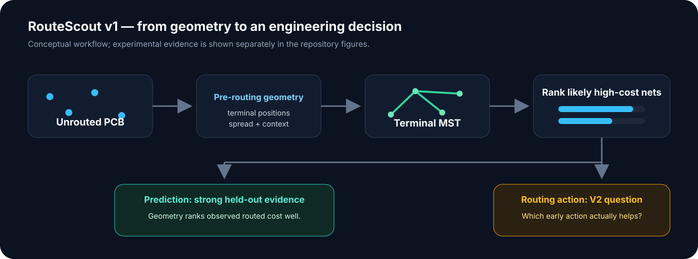
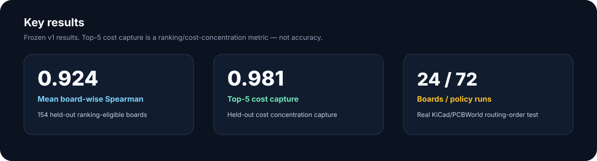

# RouteScout

**Predicting which PCB nets will become expensive before routing starts.**

RouteScout is a pre-routing decision-support study on real open-source PCB designs. It asks whether geometry available **before routing** can rank nets by the routed cost they later consume — then tests whether that prediction is enough to choose a better routing action.

[](https://github.com/Wadee19/RouteScout/actions/workflows/ci.yml)
[](pyproject.toml)
[](LICENSE)
[](RELEASE_NOTES_v1.0.0.md)

[Why it matters](#why-it-matters) · [How it works](#how-it-works) · [Results](#results) · [Real-router test](#real-router-test) · [Reproduce](#reproduce) · [Limitations](#limitations) · [V2](#v2)



## Why it matters

Some nets consume far more routing length than others. RouteScout asks whether those high-cost nets can be identified **before detailed routing begins**, using only pre-routing information.

The target is **observed routed cost**: routed wire length in an existing completed solution. It is a useful experimental proxy, but it is **not** signal integrity, impedance, RF importance, EMI risk, or intrinsic “true difficulty.”

**Dataset scale:** 1,182 PCB designs · 47,101 nets observed on Phase-2 eligible boards · 47,051 supervised candidates.

## How it works

1. **Audit the data** — solution geometry is used only for labels/evaluation, never as a pre-routing feature source.
2. **Measure net geometry** — terminal positions, spread, and a terminal minimum spanning tree (MST).
3. **Split safely** — related families and duplicate/near-duplicate risks are grouped before train/validation/test assignment.
4. **Lock the ranking rule** — terminal MST is selected on train/validation, then evaluated once on the held-out test.
5. **Test the deployment idea** — a real KiCad/PCBWorld experiment checks whether routing predicted-expensive nets first improves routability.

The MST is a geometric reference, **not** a legal PCB route and **not** a universal lower bound.

[Methodology](docs/methodology.md) · [Scientific history](docs/scientific_history.md)

## Results



| Held-out metric | MST-only |
|---|---:|
| Mean board-wise Spearman | **0.9240** |
| Top-5 cost capture | **0.9810** |
| Top-5 overlap | **0.8429** |
| NDCG@5 | **0.9807** |
| log-MAE | **0.1417** |

**Interpretation:** on unseen boards, simple terminal geometry ranked observed routed cost strongly. Top-5 cost capture is **not “98.1% accuracy”**; it measures how much of the true top-five routed-cost concentration is captured by the predicted top five.


### MST vs CatBoost — and why no GNN

A CatBoost residual model improved **cost-magnitude estimation** from MST log-MAE **0.1417** to **0.1247**. It did not justify replacing the simpler MST rule for the main ranking task.

A GNN was considered, but the preregistered admission logic did not show enough relational signal to justify the extra graph-model complexity. RouteScout therefore stops at the simpler model rather than adding architecture for appearance.

> **A very simple geometric baseline ranked expensive PCB nets surprisingly well — and the router experiment showed why prediction and routing policy are different problems.**

## Real-router test

After the predictive result was locked, RouteScout tested the obvious intervention: **route predicted-expensive nets first**.

The real-router experiment used **24 valid boards**, **3 policies per board**, and **72 policy runs**. There were **0 API errors**, and the requested locked order was issued exactly in all **72** runs.

For MST-hard-first minus natural order:

- mean target-routability delta: **+0.01290**
- paired-bootstrap 95% CI: **[0.00000, 0.03177]**


The point estimate was positive, but the preregistered rule required the lower confidence bound to be **strictly greater than zero**. It was not.

The frozen decision remains:

`NO_CLEAR_ROUTABILITY_BENEFIT`

That means **the evidence threshold was not crossed**. It does **not** mean the experiment proved zero benefit, that routing order never matters, or that the predictive result failed.

[Full Phase 8B limitations](docs/limitations.md) · [Frozen evidence chain](docs/reproducibility_frozen.md)

## What this means

RouteScout v1 supports three concise conclusions:

- **Pre-routing geometry is informative.** Terminal MST gives a strong held-out ranking signal for observed routed cost.
- **More AI was not automatically better.** CatBoost helped magnitude estimation; a GNN did not earn admission.
- **Prediction is not intervention.** Identifying expensive nets is easier than knowing which early routing action improves the finished board.

## V2

V1 asks:

> **Which nets are likely to become expensive?**

V2 should ask:

> **Which early routing action has positive marginal utility for the final routing outcome?**

The next research step is to study decision utility directly — for example, how congestion, topology, and remaining routing freedom change the value of routing a given net early — instead of assuming a fixed hard-first policy.

## Reproduce

The public package requires **Python 3.11+**; CI runs on Python **3.11 and 3.12**.

```bash
bash scripts/setup_dev_env.sh

python -m ruff check src scripts tests
python scripts/static_check.py
pytest -q
python scripts/verify_frozen_results.py
python -m pip check
```

No KiCad build is required to verify the public frozen results. The full Phase 8 router rerun uses a separate pinned Linux KiCad/PCBWorld toolchain.

[Reproducibility guide](docs/reproducibility_frozen.md) · [Figure provenance](docs/figure_provenance.md)

## Repository map

| Path | What is there |
|---|---|
| [`src/routescout/`](src/routescout/) | Reusable analysis, integrity, geometry, and router helpers |
| [`tests/`](tests/) | Unit tests and frozen-result regression checks |
| [`notebooks/`](notebooks/) | Four readable public notebooks |
| [`results/`](results/) | Compact frozen metrics and replay tables |
| [`figures/`](figures/) | Evidence figures regenerated from frozen results |
| [`docs/`](docs/) | Methodology, limitations, provenance, reproducibility, scientific history |
| [`configs/`](configs/) | Frozen Phase 8 protocol and manifest inputs |
| [`environment/`](environment/) | Dependency specifications for historical and router environments |

### Notebooks

- [`01_model_and_evaluation.ipynb`](notebooks/01_model_and_evaluation.ipynb) — audit, modeling, validation, held-out evaluation
- [`02_router_mechanism.ipynb`](notebooks/02_router_mechanism.ipynb) — Phase 8A order-control evidence
- [`03_real_board_intervention.ipynb`](notebooks/03_real_board_intervention.ipynb) — Phase 8B routing intervention
- [`04_final_results.ipynb`](notebooks/04_final_results.ipynb) — compact final result story

## Limitations

RouteScout deliberately keeps the claim narrow.

- Observed routed length is a proxy, not intrinsic physical difficulty.
- Terminal MST is a reference, not a legal route or universal lower bound.
- The held-out test is consumed and cannot be reused for retuning.
- Phase 8B is a locked partial-reroute intervention in a pinned PCBench / PCBWorld / KiCad setup.
- V1 does **not** establish that hard-first ordering improves routability.

See [`docs/limitations.md`](docs/limitations.md) for the full scientific boundary.

## Author & license

**Built and researched by [Ahmed Wadee](https://github.com/Wadee19).**

RouteScout is released under the [MIT License](LICENSE). If you use the project in research, see [`CITATION.cff`](CITATION.cff).

---

**One-line takeaway:** RouteScout can identify which nets are likely to become geometrically expensive before routing; choosing the routing action that improves the final result is the harder next problem.
